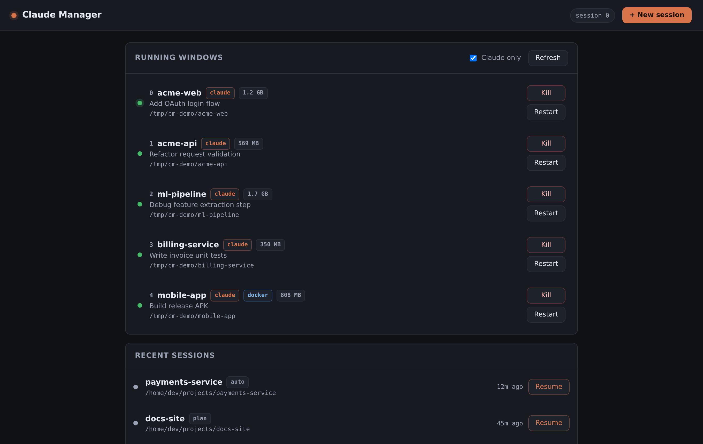
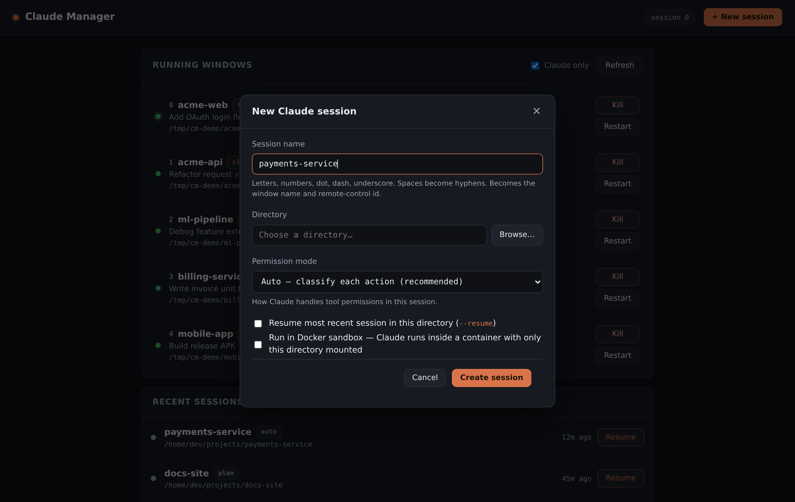
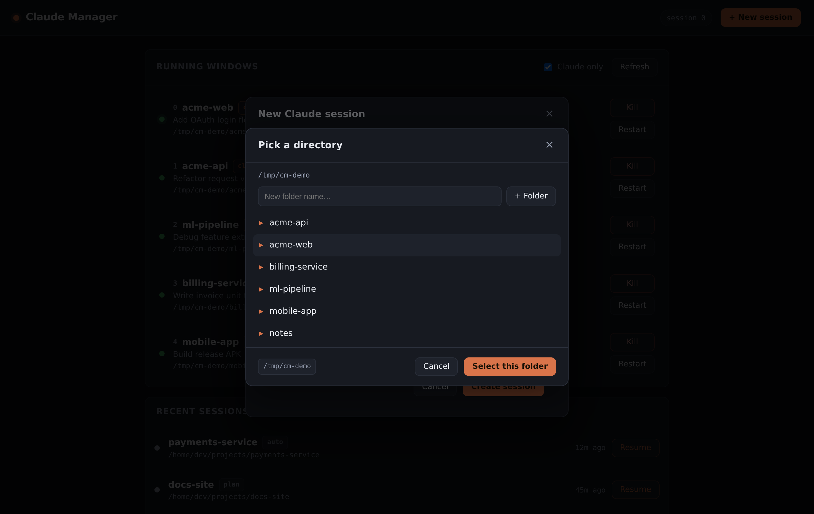

# Claude Manager

A small web app for running [Claude Code](https://claude.com/claude-code)
sessions inside **tmux**, from your browser.

Each session is a Claude process living in its own tmux window on a server. The
web UI lets you start new ones (pick a name and a project directory), see the
ones already running — including how much memory each is using — and stop or
restart them, all without opening a terminal. When you do want a terminal, it
shows you the exact `tmux attach` command to drop straight into any session.

Because the sessions are plain tmux windows, they keep running after you close
the browser, survive SSH disconnects, and you can attach to them from a real
terminal whenever you like. The web app is just a convenient front door.



## Why you'd use it

- **Start Claude sessions from your phone or any browser** on your network, and
  reconnect to them later from anywhere.
- **See everything at a glance** — which sessions are alive, what directory each
  is working in, whether each is still connected to Anthropic, and its live
  memory footprint.
- **Keep long-running sessions alive** on an always-on box (a home server, a
  Raspberry Pi, a VPS) instead of tying them to your laptop.
- **Optionally isolate a session in Docker** so Claude runs against one project
  directory and nothing else on the machine.

## How it works

```
Browser ──▶ (optional reverse proxy: TLS + auth) ──▶ Node service ──▶ tmux ──▶ claude
```

The Node service binds to `127.0.0.1` only and talks to the tmux server of the
user it runs as — no root, no privilege bridge. It never sends prompts to
Claude; it only creates, lists, and kills tmux windows. Every value it hands to
tmux is validated first (session names match a strict pattern, directories are
resolved and confined to an allow-list), so the tmux command line can't be
injected.

Starting a session runs the same command you would type by hand:

```
tmux new-window -n <name> -c <dir> claude --remote-control <name> \
  (--permission-mode <auto|default|acceptEdits|plan> | --dangerously-skip-permissions) [--resume]
```

`--remote-control` registers the session with the Claude app so you can also
drive it from your phone; the permission mode is chosen per session in the UI.

## Requirements

- Linux with **cgroup v2** (standard on current distros — needed for the
  per-session memory readout).
- **Node.js 18+**.
- **tmux**.
- The **`claude`** CLI on the service user's `PATH`
  ([install Claude Code](https://claude.com/claude-code)).
- *(Optional)* **Docker**, only if you want sandboxed sessions.

## Install

```bash
git clone https://github.com/xionic/claude-manager.git
cd claude-manager
sudo ./deploy/install.sh
```

The installer sets up and starts a systemd service that runs as the user who
invoked `sudo` (so it uses that user's tmux server), then prints the local URL.
By default it exposes the app on `127.0.0.1:8765` only. It is idempotent — re-run
it any time, e.g. after pulling changes.

Then open <http://localhost:8765/> (or tunnel to it over SSH). To reach it from
other devices, put a reverse proxy in front — see
[Exposing it on your network](#exposing-it-on-your-network).

### Run it directly (no service)

```bash
node server.js
# in another terminal:
curl -s localhost:8765/api/sessions | jq
```

## Configuration

All configuration is via environment variables (set them in the systemd unit,
or in your shell when running directly).

| Variable            | Default                       | Purpose                                          |
|---------------------|-------------------------------|--------------------------------------------------|
| `CM_PORT`           | `8765`                        | Port the service listens on                      |
| `CM_BIND`           | `127.0.0.1`                   | Bind address (keep it on localhost)              |
| `CM_TMUX_SESSION`   | `0`                           | tmux session new windows are created in          |
| `CM_ALLOWED_ROOTS`  | `$HOME`                       | Comma-separated roots the directory picker is confined to |
| `CM_TMUX_BIN`       | `/usr/bin/tmux`               | tmux binary                                      |
| `CM_CLAUDE_BIN`     | `claude`                      | claude binary (resolved on the service's PATH)   |
| `CM_TMUX_SOCKET`    | `/tmp/tmux-<uid>/default`     | tmux socket path                                 |
| `CM_MEM_LOG`        | `~/.claude-manager-memory.log`| Per-session memory history log (set interval to 0 to disable) |
| `CM_MEM_LOG_INTERVAL_MS` | `60000`                  | How often to sample session memory               |
| `CM_DOCKER_IMAGE`   | `claude-sandbox:latest`       | Image tag for sandboxed sessions                 |
| `CM_CLAUDE_CREDS`   | `~/.claude/.credentials.json` | Credentials mounted into a sandbox               |
| `CM_KVM_DEVICE`     | `/dev/kvm`                    | KVM device passed through when enabled           |

## Using it

**Start a session.** Click **+ New session**, give it a name, browse to a
project directory, pick a permission mode, and start. The session appears in the
list and, if you've registered remote control, in the Claude app too.

| New session | Directory picker |
|---|---|
|  |  |

**Watch memory.** Each running session shows its live memory use (the Claude
process and everything it spawns). The badge turns amber past 4 GB and red past
8 GB, so a runaway session is easy to spot. A rolling history is also written to
the memory log for after-the-fact diagnosis.

**Attach from a terminal.** Click a session to get the `tmux attach` command
that jumps straight to that window.

**Restart a session.** If a session's connection to Anthropic drops (it shows as
*disconnected*), **Restart** kills and re-launches it, resuming the same
conversation.

## Docker sandbox sessions

The **New session** dialog has a **Run in Docker sandbox** toggle. With it on,
the tmux window runs Claude *inside a container* built from [`docker/`](docker/)
rather than directly on the host. The container gets:

- the chosen project directory mounted at `/workspace` — and nothing else of the
  host filesystem;
- your `~/.claude/.credentials.json` mounted read-only, so it's already signed in;
- a persistent per-session Docker volume for the container's home, so `--resume`
  returns to the same conversation across restarts.

The first sandbox session builds the image (a few minutes); you can also
pre-build it from the dialog. The toggle is disabled if the service can't reach
Docker.

**KVM (hardware virtualisation).** If the sandbox toggle is on *and* the host has
`/dev/kvm`, an **Enable KVM** option appears. It maps the device into the
container (adding its owning group so the container user can open it) — useful
for, say, booting an x86_64 Android emulator inside the sandbox. It's opt-in per
session because it slightly widens what the container can touch. The image ships
build tools but not the Android SDK; install that in-session if you need it.

> To use sandboxes the service user must be in the `docker` group
> (`sudo usermod -aG docker <user>`, then restart the service). Docker calls are
> wrapped in `sg docker` so group membership applies even if the tmux server was
> started before the user joined the group.

## Exposing it on your network

The service is deliberately localhost-only. To reach it from other devices, run
a reverse proxy that adds TLS and authentication in front of it. Any proxy works
(Caddy, nginx, Apache); an example Apache config is in
[`deploy/apache-claude-manager.conf`](deploy/apache-claude-manager.conf), and the
installer can set Apache up for you:

```bash
sudo WITH_APACHE=1 ./deploy/install.sh
```

That enables the needed Apache modules, prompts for a Basic-auth password, and
installs a proxy config that serves the app at `https://<your-host>/claude-manager/`,
restricted to your LAN. Adjust the `Require ip` line to match your subnet (add
your Tailscale range, `100.64.0.0/10`, if you use it).

Whatever proxy you choose: **keep it behind authentication and off the public
internet.**

## Companion: autoclaude

Claude Code pauses when you hit a usage limit. [autoclaude](https://github.com/xionic/autoclaude)
watches for the reset and continues sessions automatically. Claude Manager just
manages the windows; autoclaude keeps them moving. If an `autoclaude` binary is
on the service's `PATH`, the New-session dialog offers to launch it in its own
window when it creates the tmux session.

## Security notes

- Starting a session runs `claude` as the service user in the permission mode you
  pick. **Dangerously skip all permissions** runs with no permission checks —
  treat access to this app as equivalent to a shell login for that user. Keep it
  authenticated and on your LAN only.
- The directory picker is confined to `CM_ALLOWED_ROOTS`, with symlinks resolved;
  anything outside is rejected.
- Session names are limited to `[A-Za-z0-9._-]` (1–64 characters).

## License

MIT
